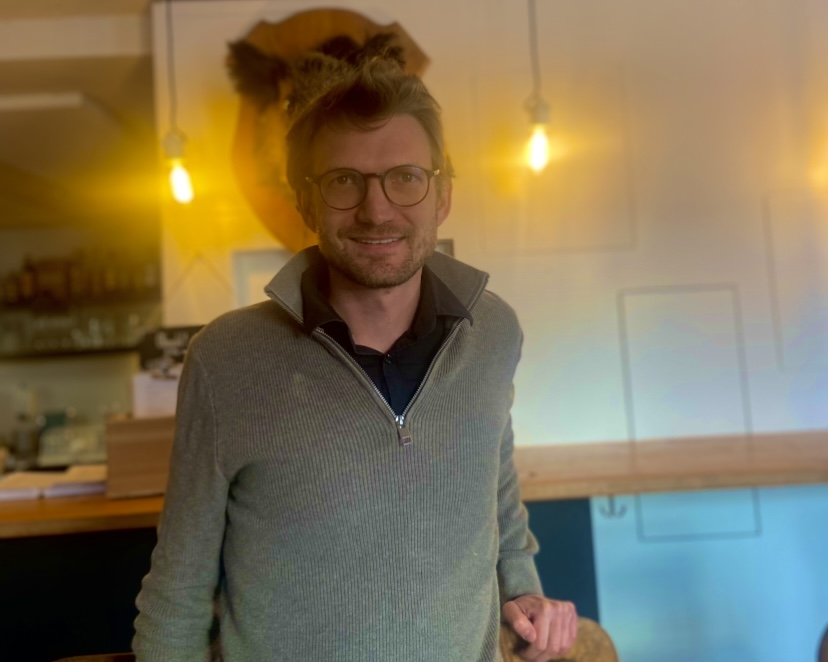

+++
title = "Es geht gar nicht darum, Mitleid zu haben"
date = "2025-02-12"
draft = false
pinned = false
image = "img_4838-1-.jpg"
description = ""
+++



Der 34-jährige Florin Hofer ist Betriebsleiter zweier inklusiver Restaurants in Bern. Im Interview erzählt er über Inklusion und wo unsere Gesellschaft heute steht.

###### Lenia Aeschbacher & Emilia Lewis



Ein Wildschwein beobachtet die Hereintretenden. Doch nicht nur es ist aufmerksam, wir werden sofort freundlich von einer Mitarbeiterin begrüsst. Wir befinden uns in einem geräumigen, heimelig eingerichteten Raum. Aus der Küche weht ein himmlischer Duft. Auf unsere Frage nach dem Betriebsleiter zeigt die Mitarbeiterin auf einen geschäftigen Mann mit dunkelblonden Haaren und Brille. Er sitzt an einem der Tische des menschenleeren Restaurants. Freundlich werden wir begrüsst, er bietet uns sofort das Du an. Später wird er darüber lachen, wenn wir ihn aus Gewohnheit siezen.

**Florin Hofer, Sie sind der Betriebsleiter des Provisorium 46, eines inklusiven Restaurants. Was bedeutet Inklusion für Sie?**

Inklusion ist ein Begriff, der noch nicht so lange bekannt ist. Früher hat man von Integration gesprochen, wenn die Menschen wieder Anschluss finden und nicht einfach im Heim zugrunde gehen. Die Inklusion hingegen will, dass ein Leben selbstständig und selbstbestimmt wahrgenommen werden kann, und zwar von allen Menschen. Wir gehen in all unseren Betrieben explizit auf Menschen mit Beeinträchtigungen ein. Sie sollen selbstbestimmt am Leben teilnehmen können. Dazu gehört, dass sie sagen können, wie und wo sie arbeiten wollen und in welchen Bereichen sie Unterstützung brauchen. So bieten wir einen Lebensraum und Arbeitsort, wo die Menschen wachsen können, und möglichst ohne viel Hilfe von aussen am Leben teilnehmen können.

**Wie ist die Geschichte des Provisoriums?**

Vor über 20 Jahren hat Jonas Staub die Nonprofitorganisation Blindspot gegründet, die sich für Inklusion einsetzt. Es begann mit einem Wintercamp für Kinder und Jugendliche, später gab es auch ein Sommercamp. Beide Lager werden mit Menschen mit und ohne Beeinträchtigung durchgeführt. Die Nachfrage wurde immer grösser, und so hatte er die Idee, in den Arbeitsmarkt einzusteigen. So ist das Provisorium 46 entstanden: Eine Firma, wo Menschen mit Beeinträchtigung angestellt und ausgebildet wurden. Auch heute arbeiten wir im ersten Arbeitsmarkt, das heisst wir sind nicht von Staat, Kanton oder anderen Gesellschaften abhängig.

> *Aber scheitern heisst ja nicht, dass man etwas Schlechtes macht, sondern dass man etwas probiert hat. (Florin Hofer)*

**Gibt es Dinge, über die Sie früher anders gedacht haben?**

Ich glaube, es war schon immer so, dass ich Menschen nicht vorverurteilt habe oder ein falsches Bild von Menschen mit Beeinträchtigung hatte. Ich habe diese Menschen schon immer als einen Mehrwert erachtet und das Potenzial für dieses Berufsfeld gesehen. Sicher musste ich mich in diese Rolle einfinden, habe aber schnell gemerkt, dass ich gerne alle Arten von Menschen um mich herumhabe. Es geht darum, wie empathisch man ist und ob man in Stresssituationen einen klaren Kopf behalten kann. Den braucht es schon, weil es manchmal Dinge gibt, die man zehnmal erklären muss, bis es dann funktioniert. Aber ich bin von Grund auf ein gelassener, ruhiger Mensch.

**Doch für die 1,6 Millionen Menschen mit Behinderung ist die Auswahl beschränkt. \[…] Die meisten wohnen und arbeiten in Institutionen – abgeschottet von der übrigen Gesellschaft.  ( Angepasstes Zitat aus :<https://www.blick.ch/schweiz/nur-wenige-betriebe-stellen-behinderte-ein-timo-17-will-doch-nur-arbeiten-id8718033.html>)**

Wenn man sieht, wie viele Menschen eine Behinderung haben und man sich dann überlegt, wie viele mögliche Arbeiter: innen das wären, das ist schon krass. Und wie der Artikel sagt, viele sieht man gar nicht. Sie sind in Institutionen, vor der Gesellschaft versteckt. Ich meine, wie viele Menschen mit Trisomie 21 sieht man auf der Strasse? Wenige. Genau deswegen haben wir so viele angestellt. Und das ist unser Ziel, dass sie sichtbarer werden. Es geht gar nicht darum, Mitleid zu haben. Sie müssen nur den Raum haben, an der Gesellschaft teilhaben zu können, weil sie ein Teil unserer Gesellschaft sind.

> *Wenn immer alles gleich bleibt, dann entwickelt man sich auch nicht weiter. Und das bedeutet Stillstand, und Stillstand macht alt, auch im Kopf. (Florin Hofer)*

**Welche Rückmeldungen erhalten Sie von beeinträchtigten Mitarbeitenden?** 

Sie verlassen uns nicht so schnell, und wenn, dann nicht so gerne. Sie sind sehr gerne bei uns, weil wir fast wie eine Familie sind. Diese Menschen haben je nachdem nicht so viele Kolleg: innen und wir bieten einen Raum, wo sie Freundschaften schliessen können. Das unterstützen wir auch durch Freizeitaktivitäten, Partys oder durch Wohngemeinschaften, in denen Menschen mit und ohne Beeinträchtigung zusammenleben. So entstehen schöne Geschichten und Freundschaften.

**Was wünschen Sie sich von der Gesellschaft, um inklusives Arbeiten weiter zu fördern?** 

Man hat gemerkt, dass der Arbeitsmarkt sich in der Zukunft weiter verändern wird.Wenn immer alles gleich bleibt, dann entwickelt man sich auch nicht weiter. Und das bedeutet Stillstand, und Stillstand macht alt, auch im Kopf. Ich finde, dass der Wandel, in dem wir gerade drin sind, viel Raum bietet, weil sich das Grundverständnis für viele Sachen verändert. Unsere Nachkommen sollen auch auf dieser Welt leben können und da muss sich die Arbeitswelt auch mitverändern. In der Gesellschaft ist es sehr wichtig, dass das Thema immer wieder zu einem Politikum wird. Doch reden allein reicht nicht. Man muss den Mut beweisen, es einfach zu probieren, mit der Gefahr zu scheitern. Aber scheitern heisst ja nicht, dass man etwas Schlechtes macht, sondern dass man etwas versucht hat. Unsere Gesellschaft muss im Kern mehr Mut beweisen. Die inklusive Arbeit gibt auch die Chance, mehr Mut zu zeigen.



Florin Hofer ist in Bern aufgewachsen, wo er mit seiner Partnerin und dem Dackel Pinot lebt. Seit 2020 ist er Betriebsleiter des Provisorium 46 und mittlerweile auch von der Lorraine 22. Ausserdem ist er Berufsbildner und somit der Begleiter für die Lernenden in allen Betrieben. Schon früher habe er den direkten Bezug zu den Leuten vorgelebt. In seinem jetzigen Job sei es aber ein etwas anderes führen, etwas weniger direktiv, sondern im direkten Dialog. In seinen Worten: „Ich bin einfach Flo und man muss nicht vor mir zusammenzucken, wenn man mich sieht“. 

